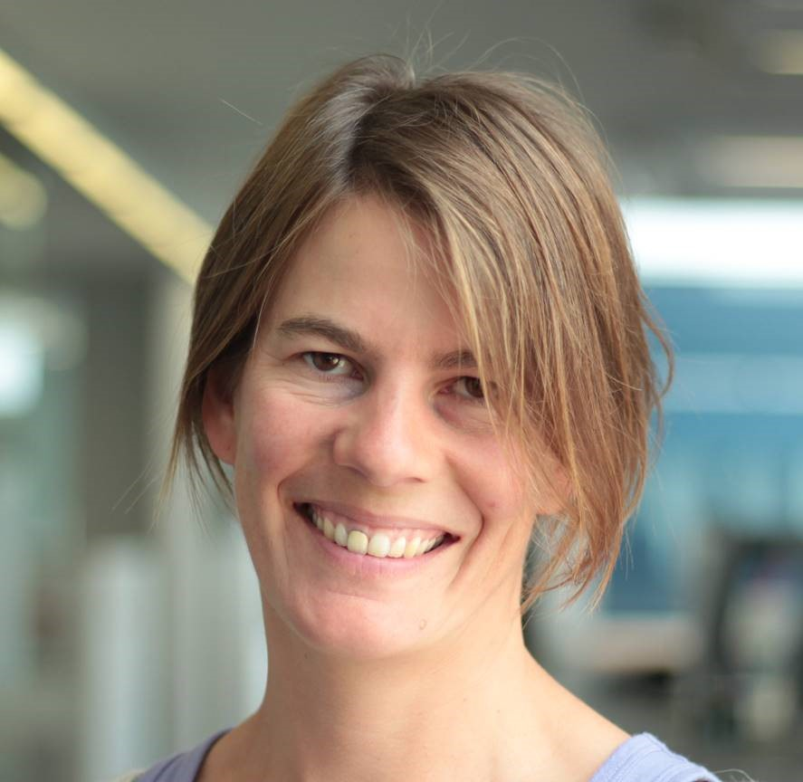
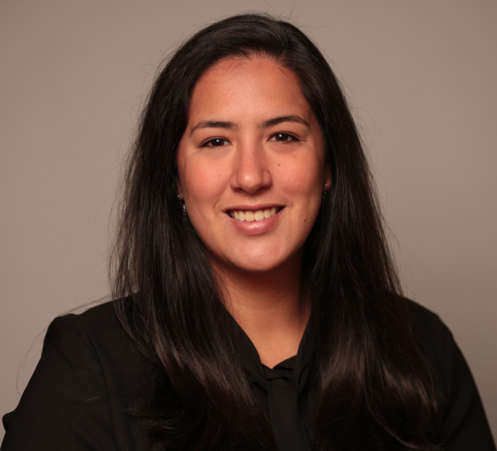

# Friendly Experts
The biogeochemical Argo community is very approachable. If you have any questions regarding BGC Argo you can contact the friendly experts on the group email address. Please also contact the gmail address if you have experience working with BGC Argo data and would like to be included on this list.

[BGCArgo.FriendlyExperts@gmail.com](mailto:BGCArgo.FriendlyExperts@gmail.com?)

# The People

### Christina Schallenberg

  
  
Christina looks after quality control for BGC Argo Australia and spends a good deal of her time thinking about phytoplankton physiology. She is particularly passionate about phytoplankton fluorescence and all the things it can and can’t tell us.

  
 
  <a href = "https://www.utas.edu.au/profiles/staff/imas/christina-schallenberg">Professional Profile</a> | <a href ="https://www.frontiersin.org/articles/10.3389/fmars.2019.00595/full">Expert work #1 </a> | <a href ="https://bg.copernicus.org/articles/17/793/2020/">Expert work #2</a>
  

 

### Nancy Williams

Nancy is a chemical oceanographer focused on studying the ocean's role in the carbon cycle and in climate using both observations and model output.  As part of her work with the SOCCOM project, she developed methods to quality control biogeochemical Argo pH data and to derive other carbonate system variables, focusing on estimating realistic uncertainties.

 
<a href = "https://www.marine.usf.edu/nancy-williams/">Professional Profile</a> | <a href ="https://agupubs.onlinelibrary.wiley.com/doi/full/10.1002/2016GB005541">Expert work #1 </a> | <a href ="https://agupubs.onlinelibrary.wiley.com/doi/full/10.1002/2016GL068539">Expert work #2</a>

- Henry Bittig
- Joellen Russel
- Seth Bushinsky
- Andrea Fassbender
- Ian Walsh
- Lidia Carracedo
- Laurent Coppola
- Marine Fourrier
- Jiaoyang Su
- Nancy Williams
- Marcos Fontela
- Nathan Briggs
- Giorgio Dall’Olmo
- Peter Croot
- Christina Schallenberg
- Marin Cornec
- Xiaogang Xing
- Martí Galí Tàpias
- Raphaëlle Sauzède
- Bozena Wojtasiewicz
- David Antoine
- Emanuele Organelli

# Programs and groups
## Argo Data Management Team
[argo-dm@jcommops.org](mailto:argo-dm@jcommops.org?)

## The SOCCOM program

## Marine Bio-optics Lab

## IMOS BGC Argo sub-facility

