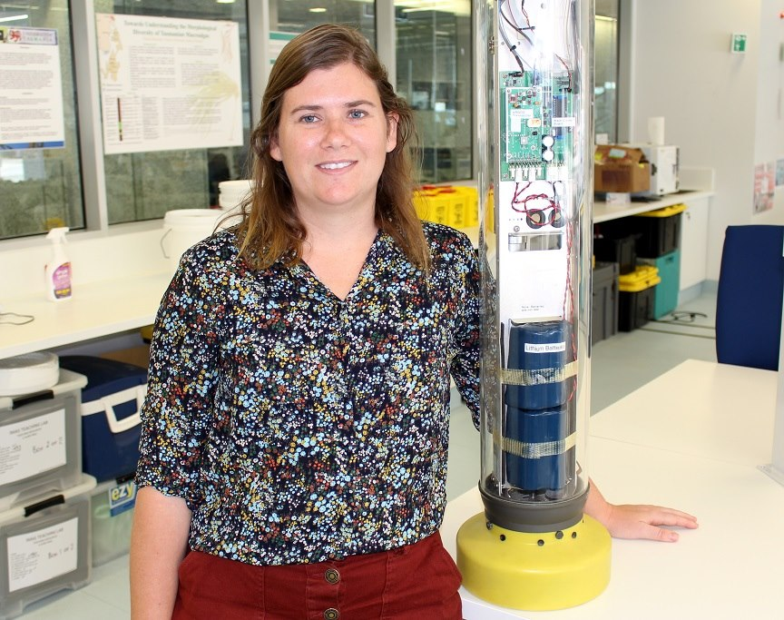

# Welcome!

The BGC Argo program is a network of robotic floats equiped with biogeochemical sensors. Data management procedures are still being developed within the program which was established in 2016. As a result, the program advises that users perform some level of quality control before scientific application. On this site you will find resources to help new and existing users navigate the program and it's associated data.

This is a continuing, collaborative effort to support new users of BGC Argo data. Led by PhD student Kimberlee Baldry from the University of Tasmania, it was established from her own experiences as a new user after her introduction to BGC Argo in 2018.

*Photo credit: Andrew Rhodes*
